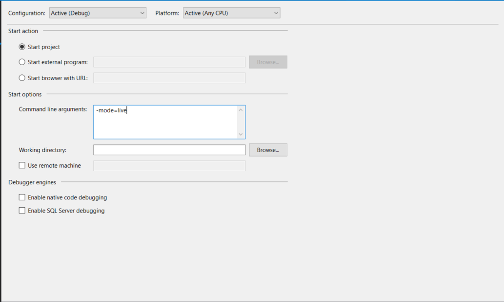
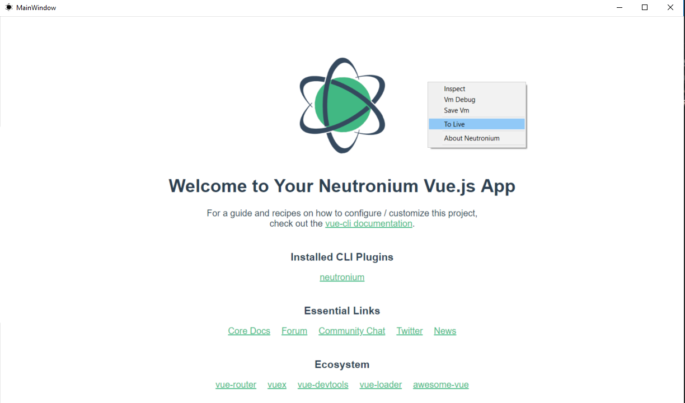
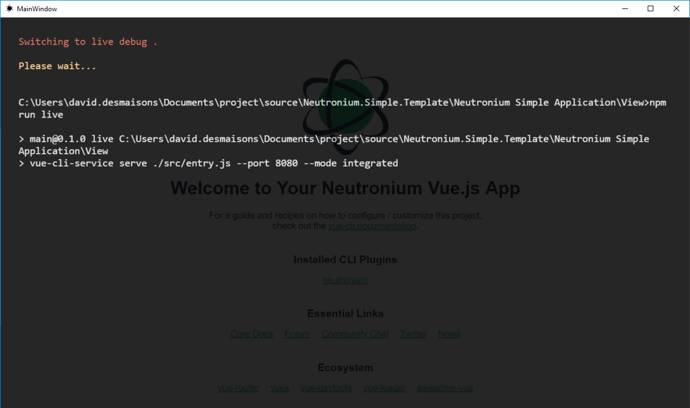
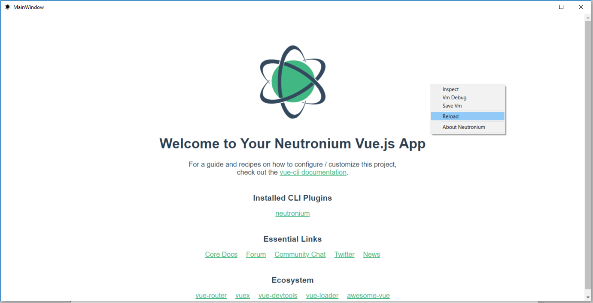

<h1 align="center">Neutronium.Simple.Template</h1>

This project is a template application for Neutronium Vue project. 

## Features

### npm script

* `npm run serve`

    Serve files for Neutronium for debug in local browser using `.cjson` files as view-model.

* `npm run live`

    Serve files for Neutronium hot-reload.

* `npm run build`

    Build files to be used in Neutronium application.

### Command line argument

        Usage:
            --mode=live
            -m=dev --url=http://localhost:9090/index.html
            -u=http://localhost:9091/index.html

        Options:
            -m --mode=(live|dev|prod)    Set application mode.
            -u --url=<uri>   Set view url

### Application mode

* Live:

        Debug mode with hot-reload activated using file served by `npm run live` scripts.

* Dev:

        Debug mode using local files.

* Prod:

        No debug, using local files.

### Injected context command

#### To Live

* Only available in `dev` mode.
* Switch to `live` mode by running `npm run live` and reloading the page using the served files.

#### Reload

* Only available in `live` mode.
* Reload the page. Maybe useful on some scenario when page does not automatically reload.

